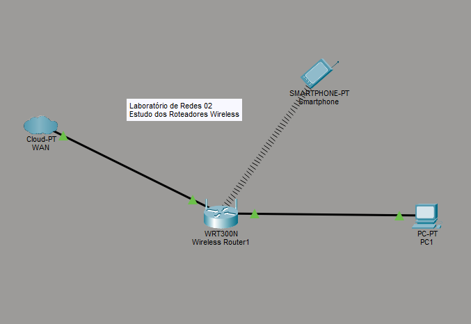

# Laboratório de Redes - Roteadores Wireless

Aluno: Reginaldo

Professor: José de Assis

Data: 10/03/2026

---
## 1. Objetivo

Configurar uma rede **Wireless (Wi‑Fi)** utilizando um roteador,
conectando um computador e um celular, além de realizar a configuração
de segurança da rede sem fio.

------------------------------------------------------------------------

## 2. Equipamentos Utilizados

-   1 Computador (PC)
-   1 Roteador Wireless
-   1 Celular

------------------------------------------------------------------------

## 3. Topologia da Rede Wireless

Segue a topologia no packet tracer:

---

## 4. Configuração Inicial da Rede

Passos realizados para iniciar a configuração:

1.  Resetar o roteador para as configurações de fábrica.
2.  Conectar a **rede do Senac na porta WAN do roteador**.
3.  Conectar o **computador em uma porta LAN do roteador**.
4.  Configurar **DHCP em todos os dispositivos** para obter IP
    automaticamente.

------------------------------------------------------------------------

## 5. Acesso ao Roteador

Para acessar o painel de configuração do roteador:

1.  Abrir o navegador no computador.
2.  Digitar o endereço do roteador.

Exemplo:

    192.168.0.1

Após isso será exibida a **interface de administração do roteador**.

------------------------------------------------------------------------

## 6. Configuração da Rede Wireless

Acessar a aba:

    Wireless

### SSID

O **SSID** é o nome da rede Wi‑Fi.

Exemplo configurado:

    Virus

------------------------------------------------------------------------

## 7. Segurança da Rede Wireless

Acessar a opção:

    Wireless Security

Existem diferentes tipos de segurança para redes Wi‑Fi.

### Tipos de Segurança

**WEP** - Muito antigo - Segurança fraca - Pode ser quebrado facilmente

**WPA Enterprise** - Usado em empresas - Utiliza autenticação com
servidor

**WPA2 Personal** - Mais comum em redes domésticas - Boa segurança - Foi
o tipo escolhido na configuração

### Método de Criptografia

    AES

### Senha da Rede Wi‑Fi

Exemplo utilizado:

    123@senac

------------------------------------------------------------------------

## 8. Alteração da Senha do Roteador

Acessar a aba:

    Administração

Alterar a **senha padrão de acesso ao roteador**.

Exemplo:

    123@senac

⚠️ **Importante**

Sempre alterar a senha padrão do roteador, pois deixar a senha original
pode permitir que outras pessoas acessem a configuração do equipamento.

------------------------------------------------------------------------

## 9. SSID Broadcast

O **SSID Broadcast** define se o nome da rede Wi‑Fi será visível ou não.

### Ativado

-   A rede aparece normalmente na lista de Wi‑Fi dos dispositivos.

### Desativado

-   A rede fica **oculta**
-   Para conectar é necessário **saber o nome da rede (SSID)** e inserir
    manualmente.

Isso pode aumentar um pouco a segurança, pois a rede não aparece
publicamente.

------------------------------------------------------------------------

## 10. Conclusão

Neste laboratório foi possível aprender:

-   Como configurar um **roteador wireless**
-   Como definir o **nome da rede (SSID)**
-   Como configurar **segurança WPA2 com criptografia AES**
-   A importância de **alterar a senha padrão do roteador**
-   Como funciona o **SSID Broadcast**

